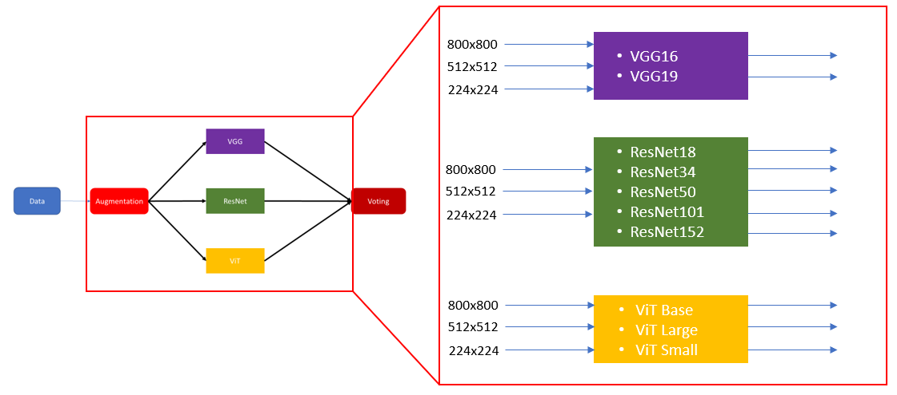

# LAB3
Lab3 CXR multi-class classification

## Datasets
| Dataset | Normal | Bacterial | Virus | COVID-19 |
|:--|:--:|:--:|:--:|:--:|
| Train | **1072** | **1888** | **1018** | **39** |
| Val | **189** | **333** | **180** | **7** |
| Test | **315** | **556** | **299** | **12** |
---

## 📁 Project Structure
```
LAB3/
│
├── preprocessing/     # Image preprocessing
├── worflow/           # worflow Image
├── train.py           # Training pipeline for classification models
└── test.py            # test and voting 
```
---
## Models in timm
| Model | Architecture in timm | 
|:--|:--:|
| ResNet | `resnet18`,`resnet34`, `resnet50`,`resnet101`,`resnet152` |
| VGGNet | `vgg16`, `vgg19` |
| Vision Transformer | `vit_base_patch16_224`, `vit_small_patch16_224`, `vit_large_patch16_224` |
---
## Code train.py

```
# select model
model_select = '#model#'

model_ft = timm.create_model(model_select, pretrained=True)
in_features = model_ft.get_classifier().in_features
model_ft.reset_classifier(num_classes=n_class)
```
## Workflow



---
## Results on Kaggle


---

## References

Ikechukwu, A. V., Murali, S., Deepu, R., & Shivamurthy, R. C. (2021). ResNet-50 vs VGG-19 vs training from scratch: A comparative analysis of the segmentation and classification of Pneumonia from chest X-ray images. Global Transitions Proceedings, 2(2), 375–381.

Alshanketi, F., Alharbi, A., Kuruvilla, M., Mahzoon, V., Siddiqui, S. T., Rana, N., & Tahir, A. (2025). Pneumonia detection from chest x-ray images using deep learning and transfer learning for imbalanced datasets. Journal of Imaging Informatics in Medicine, 38(4), 2021–2040.

Teixeira, L. O., Pereira, R. M., Bertolini, D., Oliveira, L. S., Nanni, L., Cavalcanti, G. D., & Costa, Y. M. (2021). Impact of lung segmentation on the diagnosis and explanation of COVID-19 in chest X-ray images. Sensors, 21(21), 7116.

Wang, T., Nie, Z., Wang, R., Xu, Q., Huang, H., Xu, H., ... & Liu, X. J. (2023). PneuNet: deep learning for COVID-19 pneumonia diagnosis on chest X-ray image analysis using Vision Transformer. Medical & Biological Engineering & Computing, 61(6), 1395–1408.

Fu, X., Lin, R., Du, W., Tavares, A., & Liang, Y. (2025). Explainable hybrid transformer for multi-classification of lung disease using chest X-rays. Scientific Reports, 15(1), 6650.

Ahmad, M., Usman, S., Batyrshin, I., Muzammil, M., Sajid, K., Hasnain, M., ... & Sidorov, G. (2025). Automated diagnosis of lung diseases using vision transformer: a comparative study on chest x-ray classification. arXiv:2503.18973.

He, K., Zhang, X., Ren, S., & Sun, J. (2016). Deep residual learning for image recognition. In CVPR, 770–778.

Simonyan, K., & Zisserman, A. (2014). Very deep convolutional networks for large-scale image recognition. arXiv:1409.1556.

Dosovitskiy, A., Beyer, L., Kolesnikov, A., Weissenborn, D., Zhai, X., Unterthiner, T., ... & Houlsby, N. (2020). An image is worth 16×16 words: Transformers for image recognition at scale. arXiv:2010.11929.
